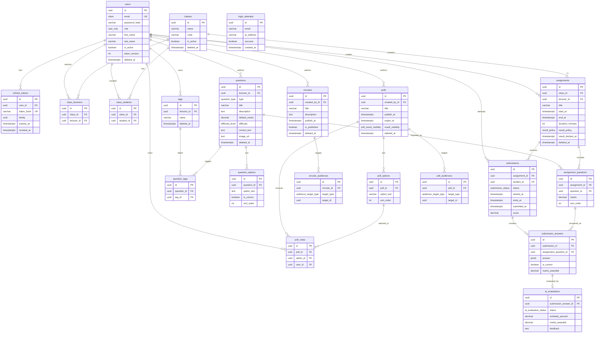
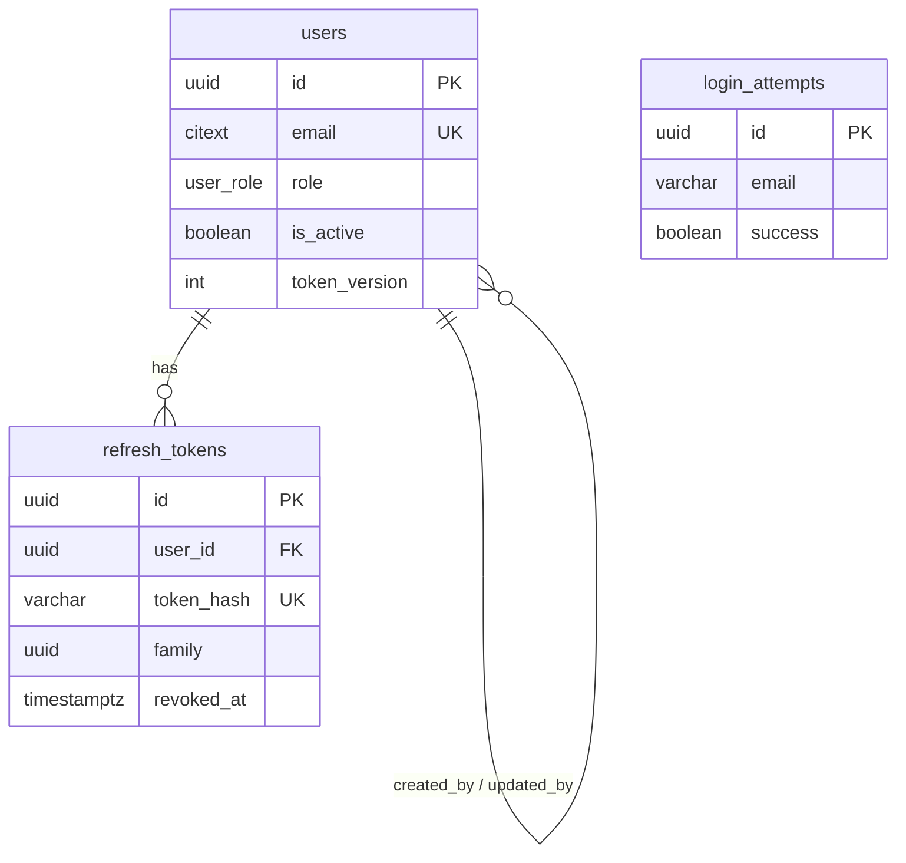
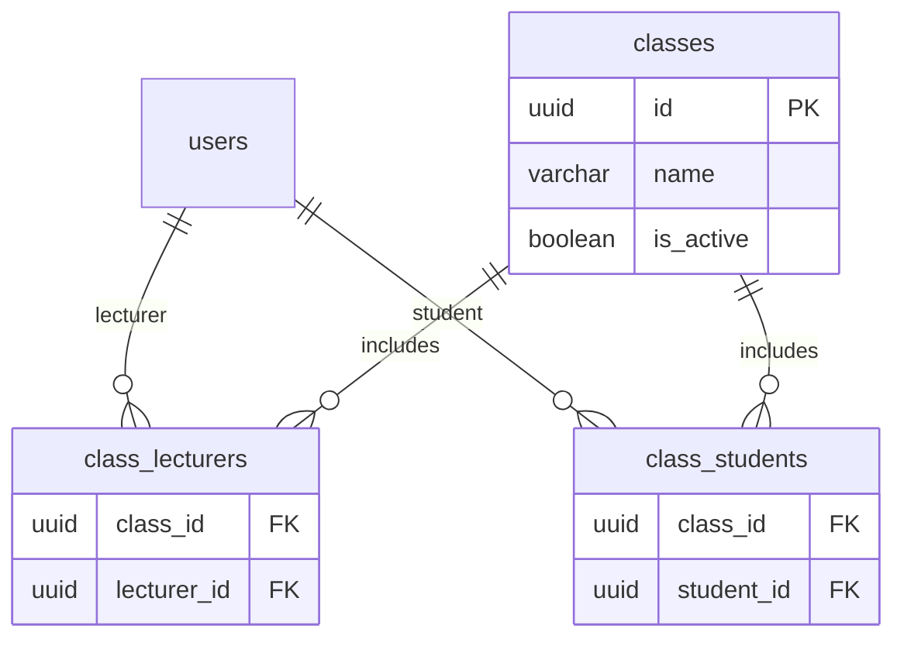
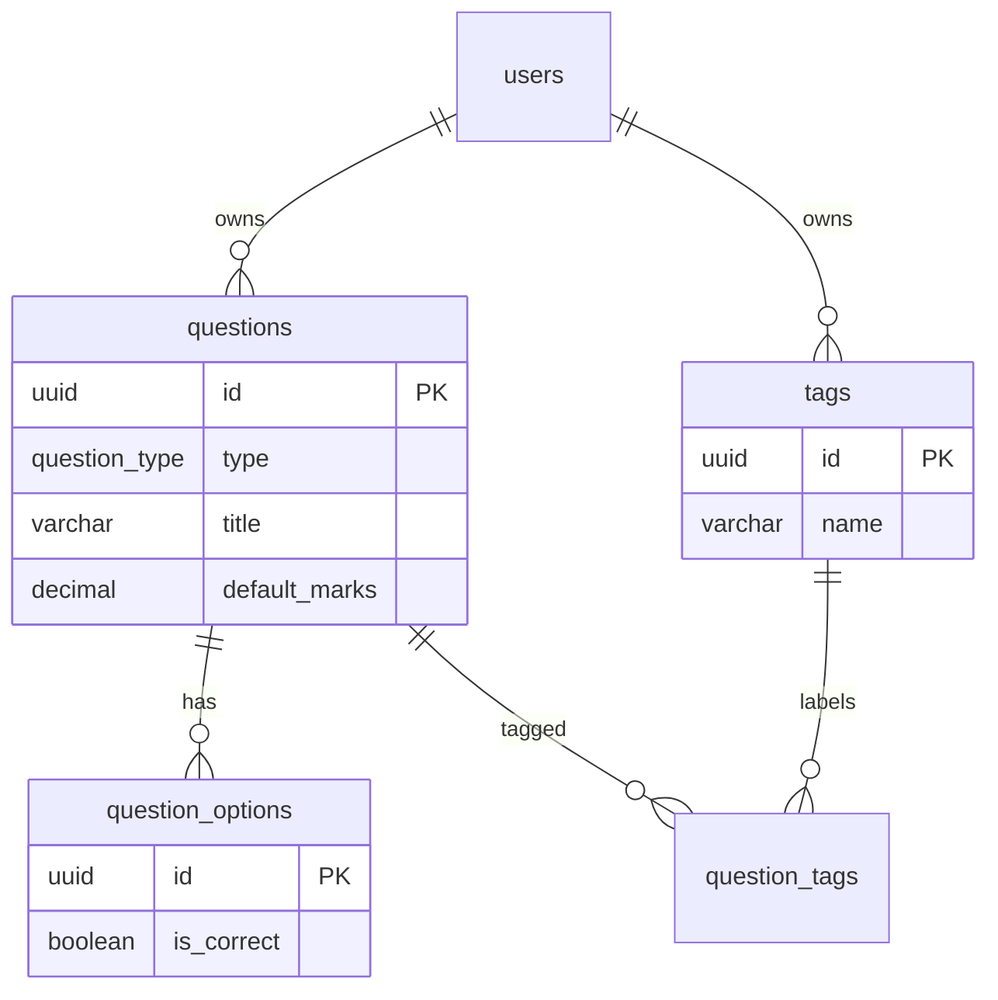
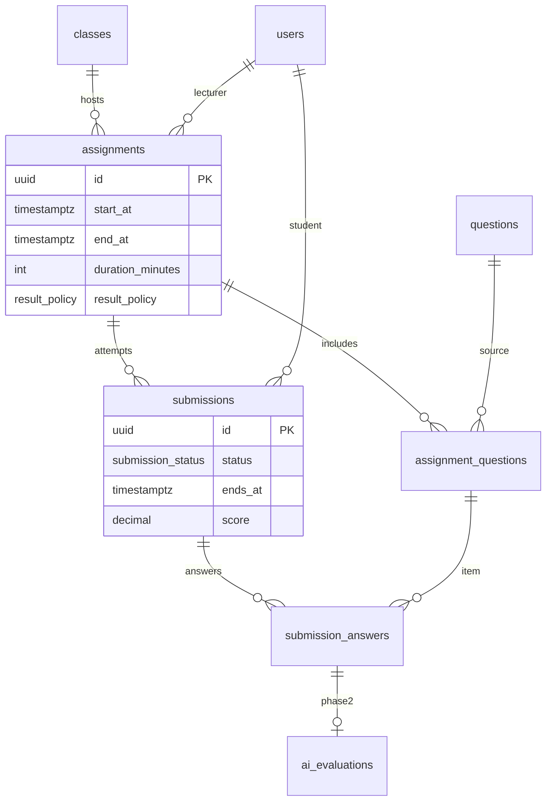
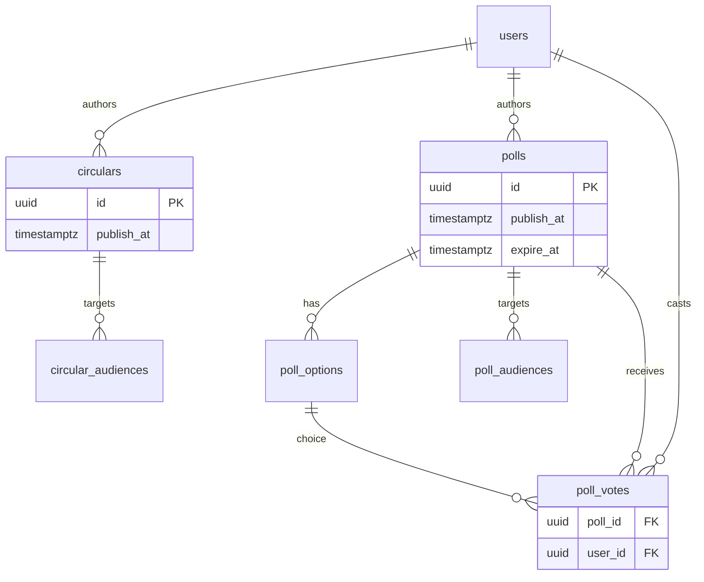
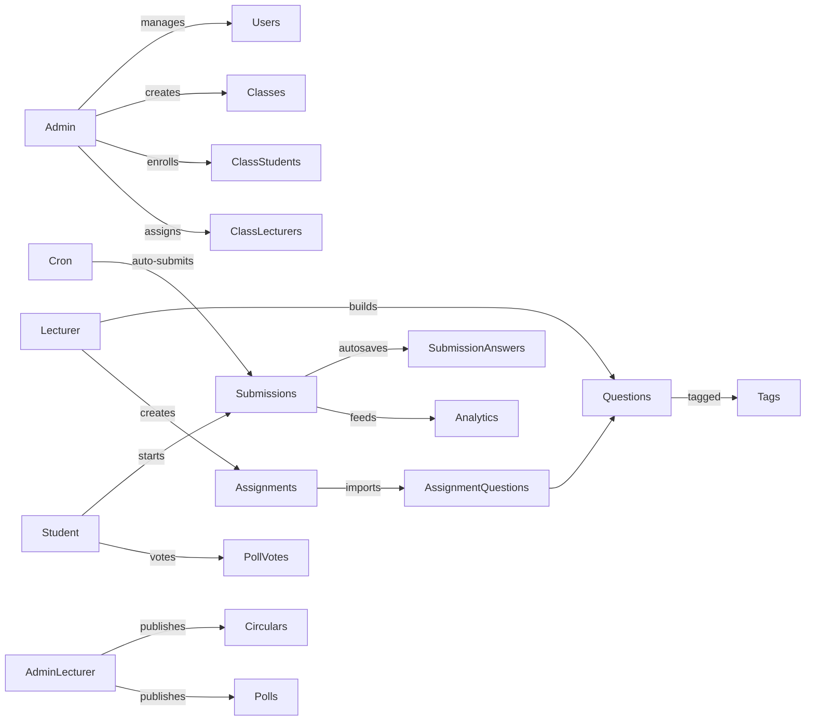

# Entity Relationship Diagram

Companion docs: [DATABASE_DESIGN.md](./DATABASE_DESIGN.md) · [SCHEMA.md](./SCHEMA.md) · [INDEXING_STRATEGY.md](./INDEXING_STRATEGY.md)

---

## 1. Full ERD (Mermaid)

---

## 2. Domain-focused diagrams

### 2.1 Auth & users

### 2.2 Classes & enrollment

### 2.3 Question bank

### 2.4 Assignments & submissions

### 2.5 Circulars & polls

---

## 3. Relationship matrix

| From | To | Cardinality | Implementing object |
| --- | --- | --- | --- |
| User | RefreshToken | One-to-Many | `refresh_tokens.user_id` |
| User | Class (as lecturer) | Many-to-Many | `class_lecturers` |
| User | Class (as student) | Many-to-Many | `class_students` |
| User (lecturer) | Tag | One-to-Many | `tags.lecturer_id` |
| User (lecturer) | Question | One-to-Many | `questions.lecturer_id` |
| Question | QuestionOption | One-to-Many | `question_options.question_id` |
| Question | Tag | Many-to-Many | `question_tags` |
| Class | Assignment | One-to-Many | `assignments.class_id` |
| User (lecturer) | Assignment | One-to-Many | `assignments.lecturer_id` |
| Assignment | Question | Many-to-Many | `assignment_questions` |
| Assignment | Submission | One-to-Many | `submissions.assignment_id` |
| User (student) | Submission | One-to-Many | `submissions.student_id` |
| Submission | SubmissionAnswer | One-to-Many | `submission_answers.submission_id` |
| AssignmentQuestion | SubmissionAnswer | One-to-Many | `submission_answers.assignment_question_id` |
| SubmissionAnswer | AiEvaluation | One-to-One | `ai_evaluations.submission_answer_id` UNIQUE |
| User | Circular | One-to-Many | `circulars.created_by_id` |
| Circular | CircularAudience | One-to-Many | `circular_audiences.circular_id` |
| User | Poll | One-to-Many | `polls.created_by_id` |
| Poll | PollOption | One-to-Many | `poll_options.poll_id` |
| Poll | PollAudience | One-to-Many | `poll_audiences.poll_id` |
| Poll | PollVote | One-to-Many | `poll_votes.poll_id` |
| User | PollVote | One-to-Many | `poll_votes.user_id` (+ unique with poll) |

---

## 4. Cascading rules

| Action | Policy |
| --- | --- |
| Soft-delete user/class/question/assignment/circular/poll | Set `deleted_at`; hide from default queries; keep FKs |
| Hard-delete user (rare / GDPR) | Cascade tokens & memberships; **block** if submissions/questions exist → soft-delete instead |
| Delete assignment (soft) | Keep submissions for history |
| Remove question from assignment | Delete `assignment_questions` row only if no `submission_answers` reference it; else RESTRICT |
| Delete circular/poll | Soft-delete parent; audiences cascade on hard delete |
| Update primary keys | Never — UUIDs immutable (`ON UPDATE NO ACTION`) |

Detailed per-FK delete actions: [SCHEMA.md § Foreign key cascade summary](./SCHEMA.md#foreign-key-cascade-summary).

---

## 5. Data-flow view (runtime)

---

## 6. Integrity highlights

1. **`uq_submissions_assignment_student`** — one attempt per student per assignment.  
2. **`uq_poll_votes_poll_user`** — one vote per user per poll.  
3. **Audience check constraints** — `target_id` required only for `USER` / `CLASS`.  
4. **Assignment window checks** — `end_at > start_at`; scheduled results require `result_declare_at`.  
5. **Ownership** — lecturer filters on `lecturer_id`; student access via `class_students` ∩ assignment `class_id`.
